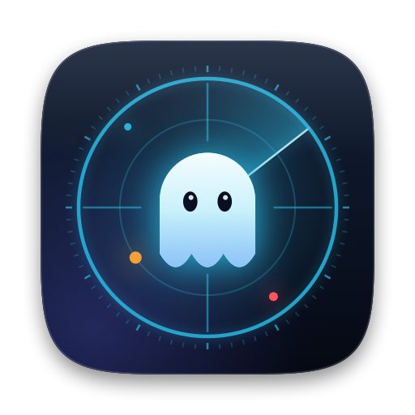
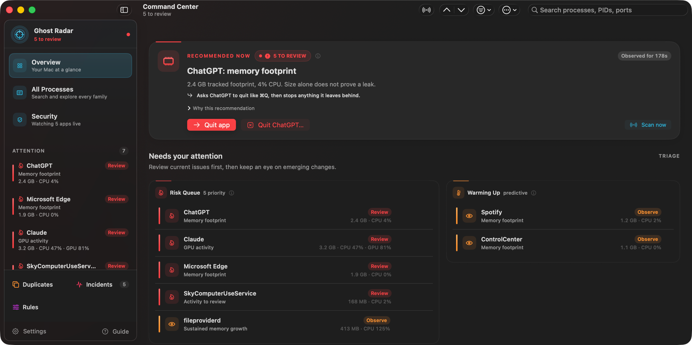
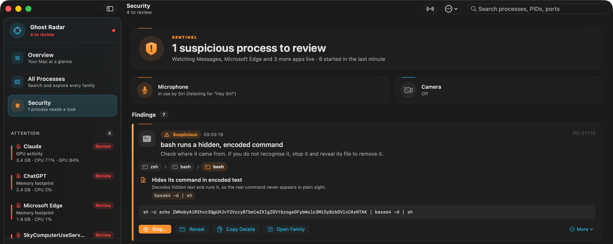
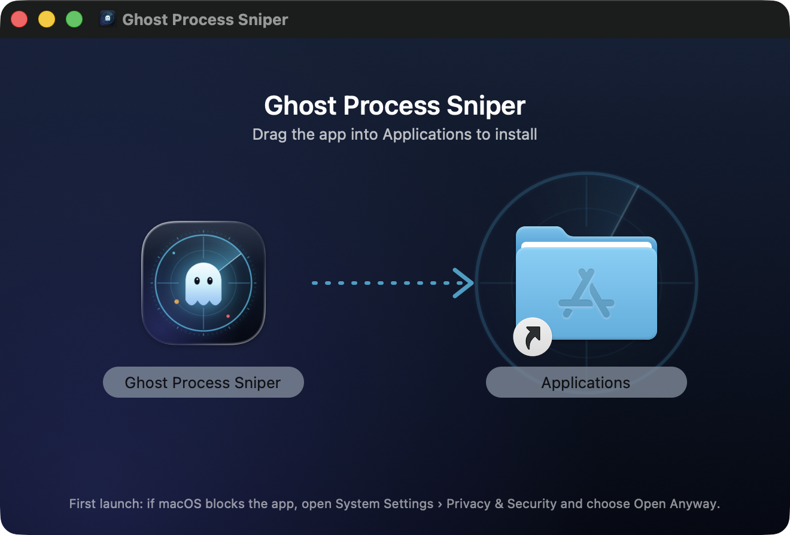

<p align="center">
  
</p>

<h1 align="center">Ghost Process Sniper</h1>

<p align="center">
  <strong>A native macOS menu-bar radar for runaway, leaking, duplicated, and forgotten processes.</strong><br>
  See what is heating your Mac, why, and what to do about it — entirely on your Mac.
</p>

<p align="center">
  <a href="https://github.com/mikkel32/ghost-process-sniper/releases/latest"></a>
  <a href="https://mikkel32.github.io/ghost-process-sniper/"></a>
</p>

<p align="center">
  
  
  
  
  <a href="LICENSE"></a>
</p>

<p align="center">
  
</p>

Dev servers that never shut down. Electron helpers that quietly grow by 50 MB a minute. Three copies of the same watcher from terminals you closed yesterday. A fan that spins up and no idea why.

**Ghost Process Sniper** watches every process you own, groups helpers into *families*, learns what normal looks like, and tells you — in plain language, with the evidence — which ones deserve attention. When something really needs to go, it previews exactly what would be stopped, waits for you to confirm, and then checks that the stop did what it promised.

## Highlights

- **Menu-bar radar.** A tiny scope whose shape and color change with the state, and a popover that leads with one verdict, the culprits, and a **Quick Stop** for the ones worth stopping.
- **Sentinel security watch.** Catches the shapes attacks take on a Mac: a browser, mail or chat app starting a shell, a pasted command that downloads and runs code (the "fake CAPTCHA" trick), hidden base64 payloads, homemade password dialogs, keychain and browser-cookie theft, reverse shells and backdoor listeners, miners, programs impersonating system processes (even with look-alike letters), apps disguised as documents, and unsigned programs in temporary or hidden folders. Browsers and terminals are watched with kernel process events, so a command that runs for 200 ms is still seen with its full arguments. New launch agents and daemons are caught the moment they are written, and the microphone and camera show who is using them. Every finding shows the chain that launched it, the exact evidence, and one next step ([how it works](Docs/Sentinel.md)).
- **Leak and runaway detection.** CPU and memory are measured for every one of your processes on every scan. Slow leaks are caught from up to 90 minutes of per-process history, and the helper that is growing is named. Builds, busy loops, idle services that start burning CPU, and a saturated Mac are told apart, so a long compile is not a "runaway".
- **Process families.** Apps, helpers, dev servers, and the workers they spawn are grouped, so you see "Slack" or "vite dev" — not forty anonymous PIDs. Language servers, databases and notebook kernels an editor starts get their own family.
- **Forgotten processes.** Judged on real evidence — a job that outlived its terminal, no CPU use for half an hour, a deleted working directory, a port held while idle — never on "its parent is launchd", which is true of every app.
- **Duplicate finder.** Spots independently started copies of the same work, says which one to keep, and stops the orphaned extras.
- **Real temperatures.** Measured CPU and GPU Celsius from hardware sensors, never invented per-app temperatures. The **Heat & CPU activity** panel names the app or job doing the work and offers a stop preview when it is yours.
- **Incident history.** A local timeline of leaks, spikes, and runaways, one entry per episode, so recurring offenders stand out.
- **Rules.** Notify, highlight, snooze, ignore, or suggest stopping matching families.
- **Careful, thorough stopping.** Every stop knows what it interrupts, so apps can save and databases can flush, and nothing that can lose data is forced unless you allow it. It offers to stop the launchd service or supervisor that would otherwise restart the process, catches children born mid-stop, and then says by name what exited and whether each port is really free ([details](#what-a-stop-does)).
- **Light on your Mac.** Background scans run at utility priority and slow down when nothing is wrong, on battery, in Low Power Mode, and when the Mac is hot; temperatures are read only while a window shows them. An open console relaxes its refresh rate when nobody has touched the Mac for a while, and its layout work was cut roughly in half ([measurements](Docs/Performance.md)). Sentinel's watchers are event-driven, so they cost nothing while nothing happens. **Settings › Diagnostics** shows what the radar itself costs.

<p align="center">
  
</p>

## Private and unprivileged by design

- **No network access.** There is no networking code: no telemetry, no analytics, no update pings.
- **No admin rights.** No privileged helper, kernel extension, or Full Disk Access. Sensor reads are read-only.
- **Your processes only.** It can only signal processes owned by your user, and only after you confirm. A protection floor below that refuses to stop Ghost itself, the terminal or app it runs inside, `loginwindow`, `WindowServer`, `launchd`, and processes macOS marks as system processes.
- **Local data.** Settings and history live in one SQLite file in `~/Library/Application Support/Ghost Process Sniper/`.
- **Sentinel stays on your Mac.** Launch feeds and captured command lines live only in memory and are never written to disk. Microphone and camera status is read from Core Audio and CoreMediaIO without opening a device or asking for permission. Findings never act on their own: stopping goes through the same preview and confirmation as everything else.

## Install

1. Download **`GhostProcessSniper-<version>.dmg`** from the [latest release](https://github.com/mikkel32/ghost-process-sniper/releases/latest) or the [website](https://mikkel32.github.io/ghost-process-sniper/).
2. Open it and drag **Ghost Process Sniper** into **Applications**.
3. Open it from Applications. It appears in the menu bar (there is no Dock icon); choose **Open Dashboard** for the full console.

<p align="center">
  
</p>

**Requirements:** macOS 26 Tahoe or later, on Apple silicon or Intel.

### "Apple could not verify…" on first launch

Release builds are signed ad hoc but not notarized by Apple (that requires a paid Developer ID), so macOS asks you to confirm the first launch:

1. Open the app once and click **Done** on the warning.
2. Go to **System Settings → Privacy & Security**, scroll to *Security*, and click **Open Anyway** next to Ghost Process Sniper.
3. Confirm with your password or Touch ID. macOS remembers the choice.

Prefer the terminal? After copying the app to Applications:

```sh
xattr -dr com.apple.quarantine "/Applications/Ghost Process Sniper.app"
```

### Verify the download

Every release is built from its tagged source by the [Release workflow](.github/workflows/release.yml) on GitHub's Macs, and each disk image carries a signed build-provenance attestation. The release page lists the SHA-256; with the [GitHub CLI](https://cli.github.com) you can also prove the file came from that build:

```sh
shasum -a 256 GhostProcessSniper-*.dmg
gh attestation verify GhostProcessSniper-*.dmg --repo mikkel32/ghost-process-sniper
```

Or skip the binary and [build it yourself](#build-from-source) — it takes about two minutes.

## Using it

Click the menu-bar scope for a summary; **Open Dashboard** opens the console (right-click the scope for a menu with Quick Stops for the top culprits):

| Section | What it answers |
| --- | --- |
| **Overview** | One verdict — what needs doing, and the button that does it — then what is urgent, what is trending the wrong way, and why. |
| **All Processes** | Every family plus every other running process, searchable by name, helper, command, path, PID, or port — typo-tolerant, with filters like `cpu>20`, `port:3000` or `is:leaking`. |
| **Security** | Whether anything running looks like an attack, what starts automatically, who is using the microphone or camera, and a live feed of every new process. |
| **Duplicates** | Which work is running more than once, which copy to keep, and which extras can go. |
| **Incidents** | What has leaked, spiked, or run away before, and how often. |
| **Rules** | What is snoozed or ignored, and how the radar should treat specific apps or commands. |

Handy shortcuts: **⌘F** search (**↩** opens the best match) · **⌘R** scan now · **⌘1–⌘6** switch sections · **⌘[** / **⌘]** back and forward · **⇧⌘⌫** stop the selection · **⌥⌘I** inspector · **⌘,** settings.

### What a stop does

Stopping always starts from a preview of the exact processes (PID plus start time, so a recycled PID is never hit) and needs **⌘↩** to confirm; Return alone never stops anything.

- **Stop** runs the phases the preview showed: a polite request first (quit like ⌘Q for apps, Ctrl-C for dev servers, the database's own shutdown signal), a wait that ends as soon as everything exits, then force for whatever is left. A job paused with Ctrl-Z is resumed so it can exit.
- **Never force-stop** — on by default for apps, editors, databases, container runtimes, git mid-operation and package installs — still runs every polite step and waits in full; it only holds back force. Anything left is reported, and **Force Stop N Processes** then sends SIGKILL to exactly those survivors.
- **launchd services.** When a `brew services` database or another KeepAlive job would be restarted within a second, the preview offers to stop the launchd service itself, until the next login or for good, and shows the `launchctl` or `brew services` command to do or undo it yourself.
- **Supervisors.** When pm2, forever or supervisord would restart the process, **Stop <supervisor> Instead** is the recommended stop; nodemon and other file watchers only restart on your next save, so stopping the child stays the default.
- **Afterwards** the result names every process's fate and checks each port the workload listened on: free, still held by a named process (with **Stop It Too**), or not fully verifiable.

The [user guide](Docs/User-Guide.md) covers every panel, the temperature tools, and exactly how a stop works.

### Temperature sensors

| Mac | Sensor map |
| --- | --- |
| Apple M1 and M2 families, Intel | Verified key tables |
| Apple M3 and M4 families | Catalog tables, not yet verified on hardware; the panel says so |
| Apple M5 and later | Sensors discovered on the Mac once per launch; best effort, and the panel says so |
| Anything else | No Celsius readings; macOS thermal pressure only, with the reason shown |

## Build from source

You need macOS 26 and Xcode 26 (or a Swift 6.3 toolchain).

```sh
git clone https://github.com/mikkel32/ghost-process-sniper.git
cd ghost-process-sniper
Scripts/dev.sh run
```

That builds an optimized, ad-hoc-signed bundle at `dist/Ghost Process Sniper.app` and opens its console. Other entry points:

| Command | What it does |
| --- | --- |
| `Scripts/verify.sh` | Architecture checks, build-script tests, unit tests, core checks, and a release build |
| `Scripts/dev.sh build` / `restart` / `debug` / `logs` | Build, restart after a build, run under LLDB, stream logs |
| `Scripts/release.sh` | Universal `.dmg` installer and checksum in `dist/release/` |
| `Scripts/release_notes.sh` | The release notes GitHub will show for the current version |
| `python3 Scripts/build_site.py --out _site` | The website in `_site/` (serve it with `python3 -m http.server -d _site`) |

## How it works

```text
ProcessMonitor (MainActor)            observable facade; schedules scans by demand, power and heat
    ├─ ThermalSampler (actor)         read-only SMC sensors, only while a window shows them
    └─ RadarRefreshWorker (actor)     one scan at a time, at utility priority
        ├─ NativeProcessSampler       libproc probes: CPU and memory for every process, then paths,
        │                             argv, ports and forensics within a deadline
        ├─ RadarPipeline              families, duplicates, baselines, member trends, CPU behavior,
        │                             forgotten-process evidence, pressure attribution, rules
        ├─ SentinelEngine (actor)     attack shapes, launch chains, offline signature checks, startup
        │                             items, microphone and camera; also woken by kernel spawn events
        ├─ RadarStore (actor)         local SQLite, versioned migrations, learned in memory and written behind
        └─ RadarPublishPayload        console snapshot and detail panels, published only when they change
ProcessKiller                         preview, protection floor, phase walker, launchd bootout, outcome checks
```

The code is split into two targets: **`GhostProcessSniperCore`** (sampling, intelligence, persistence, interventions — no UI) and **`GhostProcessSniper`** (SwiftUI app, menu bar, console). Architecture rules — folder ownership, the core/UI boundary, SQLite isolation, file-size budgets — are enforced by `Scripts/check_architecture.py`.

Further reading: [Architecture](Docs/Architecture.md) · [Sentinel](Docs/Sentinel.md) · [Development](Docs/Development.md) · [Releasing](Docs/Releasing.md) · [Thermals](Docs/Thermals.md) · [Performance measurements](Docs/Performance.md)

## Contributing

Bug reports and pull requests are welcome — see [CONTRIBUTING.md](CONTRIBUTING.md). For bugs, **Copy Diagnostics** (in **Settings › Diagnostics**, or ⇧⌘D in the console) gives a report worth pasting. Security issues: see [SECURITY.md](SECURITY.md).

## Acknowledgements

The waiting indicator is [ThinkingOrbsKit](Packages/ThinkingOrbsKit), the SwiftUI edition of the [Libraries.dev](https://libraries.dev) thinking orbs by Jakub Antalik (MIT), vendored in `Packages/`. It appears only for waits of two seconds or more.

## License

[MIT](LICENSE) © 2026 Mikkel Mynderup
